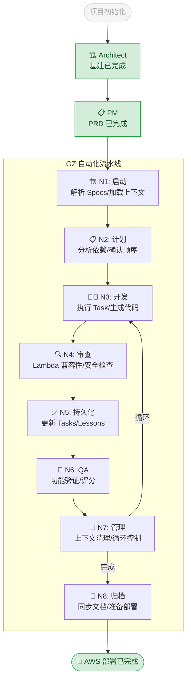

# 🤖 Stitch AI Agent 工作坊看板

当前工作流执行状态：



## 阶段说明

| 阶段 | 状态 | 说明 |
|------|------|------|
| Architect | ✅ 基建已完成 | 项目框架搭建、CLAUDE.md、开发规则配置 |
| PM | ✅ PRD 已完成 | 解析设计稿、生成产品需求文档 (PRD.md) |
| **Cycle 1** | ✅ **完成** | **F1: 项目框架搭建** |
| Cycle 1 N1-N8 | ✅ 全部完成 | Tailwind/Fonts/Env 配置 (94分) |
| **Cycle 2** | ✅ **完成** | **F2: 认证系统 + F3: Landing Page** |
| Cycle 2 N1-N8 | ✅ 全部完成 | Schema/API/Components (92分) |
| **Cycle 3** | ✅ **完成** | **F4: 上传生成 + F5: 画廊展示** |
| Cycle 3 N1-N8 | ✅ 全部完成 | Components/Pages (92分) |
| **Cycle 4** | ✅ **完成** | **F6: 定价页面 + 测试** |
| Cycle 4 N1-N8 | ✅ 全部完成 | Pricing + 20 tests passing |
| **Total** | ✅ | **20/23 Tasks (87%)** |
| DEPLOY | ✅ **完成** | 已通过 SST + OpenNext 成功部署至 AWS Lambda (URL: https://d2jy7kzi6w8a28.cloudfront.net) |

## 设计稿输入

```
/Users/gz/Desktop/Advance/Task/week_two/stitch_ai_headshot_studio/
├── aigen_studio_landing_page/
├── aigen_studio_portrait_gallery/
├── aigen_studio_pricing_plans/
├── aigen_studio_sign_in_sign_up/
├── aigen_studio_upload_generate/
└── professional_identity_system/
```

## 输出文档

- `docs/PRD.md` - 产品需求文档
