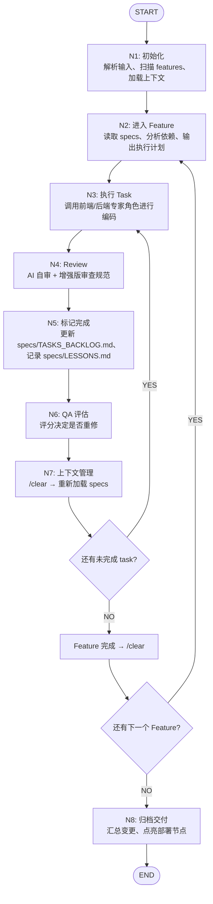

# 自动工作流指南

## 🎯 核心改进

工作流现在支持**完全自动化循环**，无需手动干预！

---

## 📊 自动循环机制

### 流程图



### 自动循环规则

#### 1. Task 级别循环
```
N3 → N4 → N5 → N6 → N7 → (检查 specs/TASKS_BACKLOG.md)
  ↓ 还有未完成 task
  → N3 (继续下一个 task)
```

**触发条件**: N7 完成后，检查当前 Feature 的 `tasks.md`
- 如果有未完成 task（未标记 `[x]`）→ 自动进入 N3
- 如果所有 task 完成 → 进入 Feature 完成流程

#### 2. Feature 级别循环
```
所有 task 完成 → N7 → /clear → (检查 specs/PLAN.md)
  ↓ 还有下一个 feature
  → N2 (进入下一个 feature)
```

**触发条件**: 所有 task 完成后，检查 `specs/PLAN.md`
- 如果有下一个 feature → 自动进入 N2
- 如果所有 feature 完成 → 进入 N8

#### 3. 全程自动化
- ✅ **无需等待用户指令**
- ✅ **自动检查任务状态**
- ✅ **自动进入下一个节点**
- ✅ **自动清理上下文**
- ✅ **自动重试（最多 3 次）**

---

## 🔄 智能上下文管理

### N1: 智能加载

根据任务类型自动加载相关文档：

| 任务类型 | 加载的文档 |
|---------|-----------|
| 前端 Feature | requirements.md, design.md, tasks.md, 设计稿 |
| 后端 Feature | requirements.md, api-design.md, tasks.md, schema.prisma |
| AI 集成 | requirements.md, ai-design.md, tasks.md, AI 服务文档 |
| 支付集成 | requirements.md, payment-design.md, tasks.md, 支付文档 |

### N7: 智能清理

```bash
# Task 完成后
/clear
→ 重新读取当前 feature 的 specs
→ 检查是否还有未完成的 task
→ 自动继续

# Feature 完成后
/clear
→ 重新读取 specs/PLAN.md
→ 检查是否还有下一个 feature
→ 自动继续
```

---

## 📝 使用示例

### 示例 1: 从 specs/PLAN.md 开始

```bash
/gz:coding
```

**自动执行**:
1. N1: 扫描 specs/PLAN.md，发现 4 个 Features
2. N2: 进入第一个待执行的 Feature
3. N3-N7: 执行所有 tasks（自动循环）
4. N2: 进入下一个 Feature
5. ... 重复直到所有 Features 完成
6. N8: 归档交付

**输出**:
```
✓ [N1] 初始化完成
发现 4 个 Features:
1. F1: 项目框架搭建: completed (5/5 tasks)
2. F2: 认证系统: in_progress (3/8 tasks)
3. F3: Landing Page: pending (0/10 tasks)
4. F4: 上传生成: pending (0/12 tasks)

准备进入 [N2] 开始执行 F2: 认证系统...

✓ [N2] 进入 Feature: F2: 认证系统
准备执行 Task 4: Google OAuth 集成

✓ [N3] 完成 Task 4
✓ [N4] 审查通过 (评分: 92/100)
✓ [N5] 标记完成
✓ [N6] QA 评估通过 (评分: 88/100)
✓ [N7] 完成
发现未完成的 task: Task 5: 邮箱验证
进入 [N3] 执行下一个 task...

... (自动继续)

✓ [N7] 完成
F2: 认证系统 所有 task 已完成
发现下一个 feature: F3: Landing Page
进入 [N2] 开始下一个 feature...

... (自动继续)

✓ [N7] 完成
所有 feature 已完成
总 task: 35/35
进入 [N8] 归档交付

🎉 全部完成
📂 Features: 4/4
📋 总任务: 35/35
```

### 示例 2: 从特定 Feature 开始

如果有 `specs/TASKS_BACKLOG.md`，可以从中选择特定任务：

```bash
# 手动指定
/gz:coding --feature "Cycle 5: 文件上传系统"
```

---

## 🎨 增强功能

### 1. N4 增强版审查 (7 大维度)

| 维度 | 检查项 |
|------|--------|
| Lambda 兼容性 | 冷启动、环境变量、Better-Auth 兼容性 |
| 安全性 | SQL 注入、XSS、CSRF、权限验证 |
| 性能 | N+1 查询、内存泄漏、代码分割 |
| 可访问性 | ARIA、键盘导航、颜色对比度 |
| 错误处理 | 边界条件、异常捕获、日志记录 |
| 代码质量 | 注释、命名、重复代码、TypeScript 类型 |
| 测试 | 单元测试、组件测试、覆盖率 |

### 2. N6 明确评分标准 (5 维度)

| 维度 | 权重 | 通过标准 |
|------|------|---------|
| 功能完整性 | 30% | >= 70 分 |
| 代码质量 | 25% | >= 75 分 |
| 性能表现 | 20% | >= 80 分 |
| 安全性 | 15% | >= 90 分（一票否决） |
| 可维护性 | 10% | >= 70 分 |

**总分**: >= 80 分通过
**重修次数**: 最多 3 次，超过则人工介入

### 3. 专项工作流

| 工作流 | 用途 |
|--------|------|
| `/gz:ai-integration` | AI 服务集成（Replicate/RunPod） |
| `/gz:payments` | 支付系统集成（Stripe/Polar） |
| `/gz:deploy-verify` | 部署后自动验证 |
| `/gz:performance` | 性能优化 |

---

## 📋 文件清单

### 已更新的节点文件

| 文件 | 更新内容 |
|------|---------|
| `N1-init.md` | 智能上下文加载、自动识别状态 |
| `N4-review.md` | 增强版审查规范（7 大维度） |
| `N6-qa.md` | 明确评分标准（5 维度） |
| `N7-context.md` | 自动循环机制、智能清理 |
| `gz:coding.md` | 流程图、自动循环规则 |

### 已创建的工作流

| 文件 | 功能 |
|------|------|
| `gz:deploy-verify.md` | 部署后自动验证 |
| `gz:ai-integration.md` | AI 服务集成 |
| `gz:payments.md` | 支付系统集成 |

---

## 🚀 立即开始

### 1. 准备工作

确保以下文件存在：

```bash
# 任务清单
specs/PLAN.md  # 或 specs/TASKS_BACKLOG.md

# 每个 Feature 的 specs
specs/F{N}/requirements.md
specs/F{N}/design.md
specs/F{N}/tasks.md
```

### 2. 启动自动工作流

```bash
/gz:coding
```

### 3. 观察执行

工作流会自动：
- ✅ 扫描所有 Features
- ✅ 识别当前状态
- ✅ 执行未完成的 tasks
- ✅ 审查和评估代码
- ✅ 清理上下文
- ✅ 自动进入下一个 task/feature
- ✅ 归档交付

### 4. 监控进度

查看 `specs/TASKS_BACKLOG.md` 顶部「当前执行状态」表格：

```markdown
## 📍 当前执行状态

| 项目 | 值 |
|------|-----|
| 当前 Cycle | Cycle 5 |
| 当前 Node | N3: 开发 |
| 当前 Task | Task 5.2: 文件上传 API |
| 上次更新 | 2026-06-16 |
```

---

## ⚙️ 配置选项

### 自动重试次数

在 `N7-context.md` 中配置：

```markdown
### 1. N6 评分不通过
- 回退到 N3 重修
- 重修次数 +1
- 如果重修次数 >= 3，暂停并请求人工介入
```

### 上下文阈值

在 `N7-context.md` 中配置：

```markdown
### 2. 上下文达到 80%
- 执行 `/compact` 压缩上下文
- 继续执行当前 task
```

---

## 🐛 常见问题

### Q1: 工作流没有自动继续？

**A**: 检查以下几点：
1. `specs/TASKS_BACKLOG.md` 是否正确标记了已完成的任务（`[x]`）
2. `specs/PLAN.md` 是否存在且格式正确
3. 是否遇到了阻塞问题（查看输出日志）

### Q2: 如何暂停工作流？

**A**: 按 `Ctrl+C` 或发送 `/clear` 命令

### Q3: 如何跳过某个 Feature？

**A**: 在 `specs/PLAN.md` 中将该 Feature 标记为 `status: skipped`

### Q4: 如何手动触发某个节点？

**A**: 直接调用对应的节点文件：
```bash
# 手动执行 N4 审查
读取 .claude/commands/gz-coding-nodes/N4-review.md
```

---

## 📊 效果对比

### 增强前

```bash
/gz:coding
# 需要手动：
# - 指定 Feature
# - 指定 Task
# - 确认每个节点
# - 清理上下文
```

### 增强后

```bash
/gz:coding
# 全自动：
# ✅ 自动扫描 Features
# ✅ 自动选择 Task
# ✅ 自动确认节点
# ✅ 自动清理上下文
# ✅ 自动循环执行
```

---

## 🎉 总结

### 核心改进

1. ✅ **自动循环**: Task 级别 + Feature 级别自动循环
2. ✅ **智能上下文**: 根据任务类型智能加载/清理
3. ✅ **增强审查**: 7 大维度全面审查
4. ✅ **明确标准**: 5 维度评分 + 通过标准
5. ✅ **专项工作流**: AI/支付/部署验证/性能优化

### 使用建议

1. **首次使用**: 先运行 `/gz:coding` 观察自动执行流程
2. **自定义**: 根据需要修改节点文件中的配置
3. **监控**: 实时查看 `specs/TASKS_BACKLOG.md`「当前执行状态」了解进度
4. **优化**: 根据 `specs/LESSONS.md` 持续改进工作流

---

**创建日期**: 2026-06-16  
**最后更新**: 2026-06-16  
**版本**: v2.0 (自动循环版)
